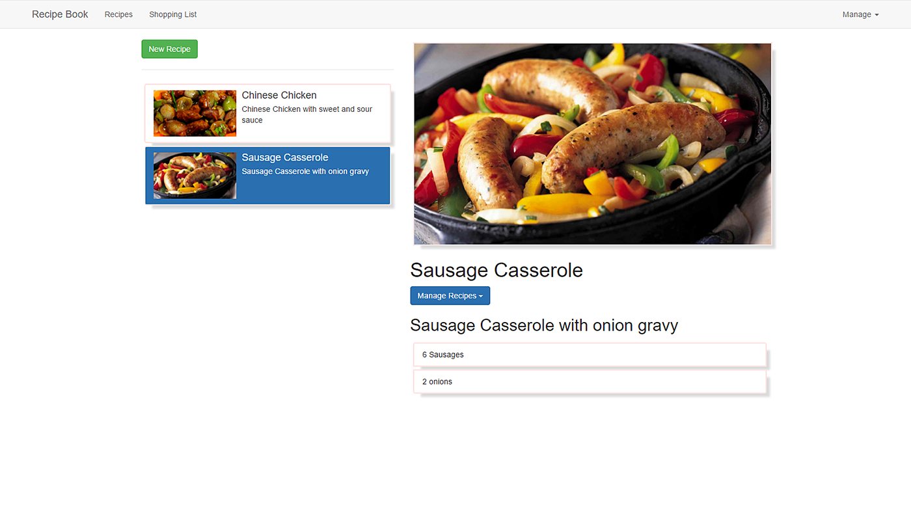

# Angular 4 Application Recipe Book


## Project View

<div align="center">

</div>


```

> git clone https://github.com/jwill9999/recipe-app.git
> cd recipe-app
> npm install
> ng serve

To Log In to example project 

> User :      admin@admin.com
> password:   123456

> Create a src/app/services/.configuation file 
> add a FIREBASE AUTHENTICATION config file which you can obtain when you create a firebase app auth account.
> example code can be found in the configuration.example.ts file
```


# RecipeApp

A comprehensive Angular application covering all of the Angular 4 updates. The project focuses on the key features and skills required to successfully implement a modern angular application. The code is commented for easy reference and links below provide additional resources. Fully functional CRUD operations with http access using RxJs observables.

## Key features

> Components

> AuthGuards

> Firebase Authentication

> Personalisation

> Services

> Forms both Reactive and Template

> Http requests

> Observables 

> Routing ActivatedRoutes and Params

> Input and Output decorators

> CRUD operations to recipes and shopping list

> Database intergration

> Models

> Creating a directive  

... to name a few 


## Links

[Angular Docs](https://angular.io/)

[Angular API Reference](https://angular.io/docs/ts/latest/api/)

[CLI Quickstart Template](https://angular.io/docs/ts/latest/cli-quickstart.html)

[Routing](https://angular.io/docs/ts/latest/guide/router.html)

[Pipes](https://angular.io/docs/ts/latest/guide/pipes.html)

[Deployment](https://angular.io/docs/ts/latest/guide/deployment.html)


[Recommended Angular 4 tutorial Maximilian Schwarzmüller](https://www.udemy.com/the-complete-guide-to-angular-2/learn/v4/content)

This project was generated with [Angular CLI](https://github.com/angular/angular-cli) 

<hr>

## Development server

Run `ng serve` for a dev server. Navigate to `http://localhost:4200/`. The app will automatically reload if you change any of the source files.

## Code scaffolding

Run `ng generate component component-name` to generate a new component. You can also use `ng generate directive/pipe/service/class/module`.

## Build

Run `ng build` to build the project. The build artifacts will be stored in the `dist/` directory. Use the `-prod` flag for a production build.

## Running unit tests

Run `ng test` to execute the unit tests via [Karma](https://karma-runner.github.io).

## Running end-to-end tests

Run `ng e2e` to execute the end-to-end tests via [Protractor](http://www.protractortest.org/).
Before running the tests make sure you are serving the app via `ng serve`.

## Further help

To get more help on the Angular CLI use `ng help` or go check out the [Angular CLI README](https://github.com/angular/angular-cli/blob/master/README.md).
